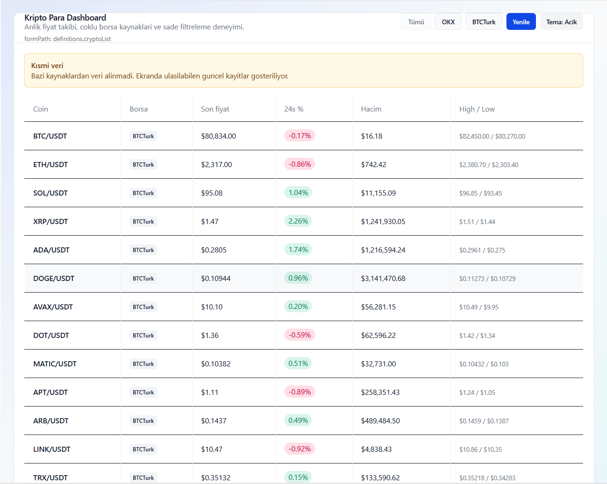
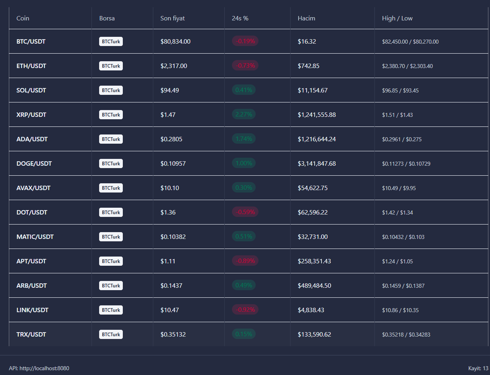
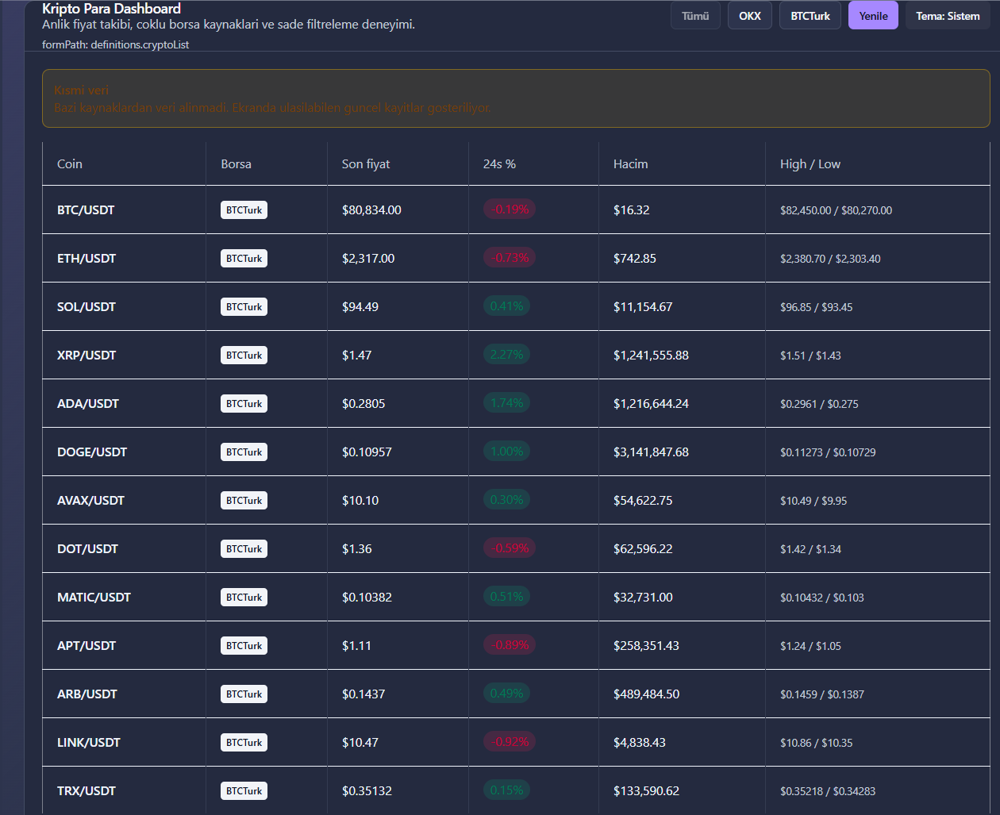
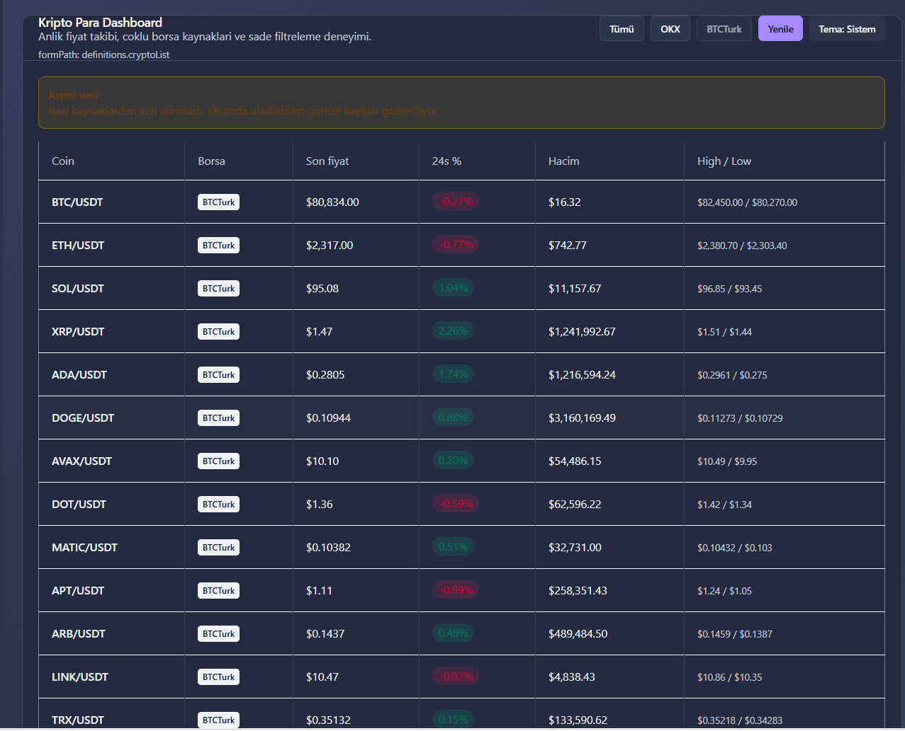
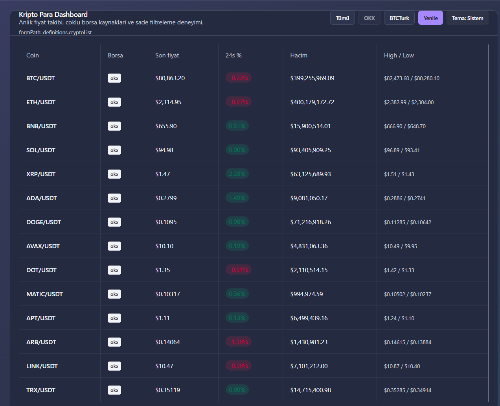

# crypto-dashboard-microservices-grpc

Polyglot crypto dashboard with React frontend, Go API gateway, and Python market data service using gRPC/Protobuf between services.

## Architecture

- `frontend/`: React + Vite UI
- `api/`: GoFiber REST gateway
- `ccxt-service/`: Python data service (gRPC server)
- `proto/`: shared Protobuf contract

Data flow:

1. Frontend calls Go REST API (JSON over HTTP).
2. Go API calls Python service via gRPC (`GetCryptoList`) using a **reused** gRPC client (one connection per API process).
3. Python fetches market data and returns rows to Go, which responds to the browser.

### Data sources (`source` query param)

| Value | Behavior |
|---|---|
| `btcturk` | Single REST call to BTCTurk ticker API (~fastest). |
| `okx` | CCXT OKX: targeted symbol tickers (not full-market `fetch_tickers` unless `CCXT_USE_FULL_TICKERS=true`). |
| `all` (UI default) | **BTCTurk first**; OKX only if BTCTurk returns no rows. Same speed profile as `btcturk` in normal conditions (~3–5s cold). |

Responses are cached in Python for **`CRYPTO_CACHE_TTL_SECONDS`** (default 8s) per `source`. When `all` is served from BTCTurk, the `btcturk` cache entry is warmed too.

## Screenshots & demo

PNG previews are in [`images/`](images/); a screen recording is in [`videos/`](videos/).

<p align="center">
  
  
</p>
<p align="center">
  
  
</p>
<p align="center">
  
</p>

**Demo video:** [screen recording](videos/Crypto%20Dashboard%20-%20Ki%C5%9Fisel%20-%20Microsoft%E2%80%8B%20Edge%202026-05-11%2018-18-42.mp4) (Edge export; the filename contains a zero-width space after “Microsoft”, which is why a plain copy-paste link can break).

## Environment Variables

| Service | Variable | Default |
|---|---|---|
| Python gRPC | `PORT` | `5000` (HTTP app, optional) |
| Python | `CRYPTO_CACHE_TTL_SECONDS` | `8` (`0` disables in-memory cache) |
| Python | `CCXT_SYMBOL_WORKERS` | `6` (parallel per-symbol OKX fetches) |
| Python | `CCXT_USE_FULL_TICKERS` | unset (`true` restores full-market OKX `fetch_tickers`) |
| Go API | `PORT` | `8080` |
| Go API | `CCXT_GRPC_ADDR` | `localhost:50051` |
| Go API | `PYTHON_GRPC_TIMEOUT_SECONDS` | `45` |
| Go API | `CORS_ORIGIN` | `http://localhost:5174,http://localhost:5173,http://localhost:3000` |
| Frontend | `VITE_API_BASE_URL` | `http://localhost:8080` |

## Run Locally

### 1) Python gRPC service

```bash
cd ccxt-service
pip install -r requirements.txt
python grpc_server.py
```

### 2) Go API

```bash
cd api
go mod tidy
go run .
```

### 3) Frontend

```bash
cd frontend
npm install
npm run dev
```

Open: `http://localhost:5174`

## API Endpoints

- Health: `GET /api/health`
- Crypto list: `GET /api/crypto?source=all|okx|btcturk`
- Single symbol: `GET /api/crypto/:symbol?source=all|okx|btcturk`

## Notes

- Inter-service transport is gRPC/Protobuf (Go → Python). The browser does **not** call gRPC directly.
- Frontend communication remains REST (Frontend → Go).
- `source=all` usually shows **BTCTurk** rows (13/14 symbols); use `source=okx` for full OKX coverage (slower cold fetch).
- Local smoke tests can live under `scripts/` (not required to run the app).
